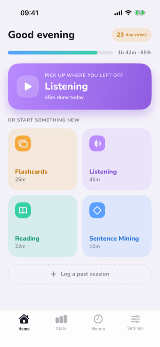
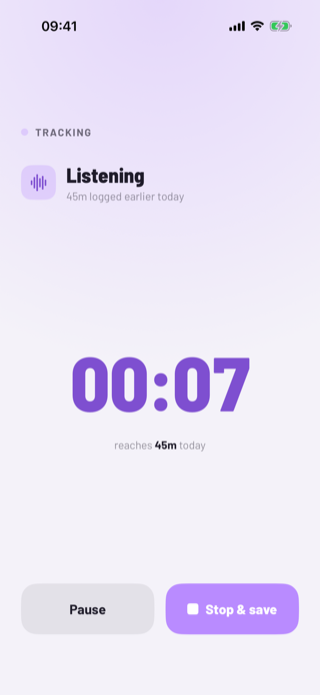
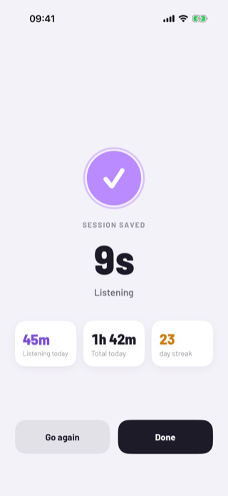
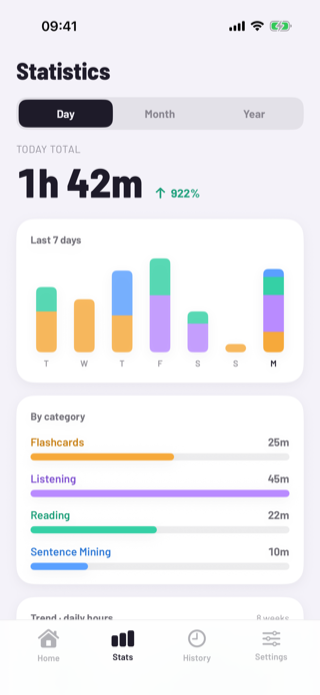
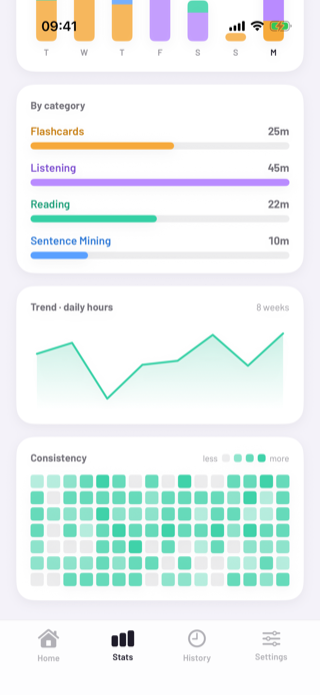
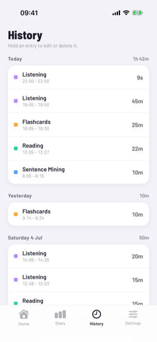
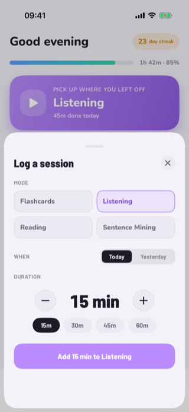

# Traki

**The one-tap time tracker for language learners.** Open the app, tap one of four study modes, and a stopwatch starts immediately. Stop to see the session added to your day; statistics turn those sessions into streaks, trends and a consistency heatmap. Widgets, an App-Intent quick-start, and a Live Activity let you start and monitor a session without opening the app.

Built natively in **SwiftUI**, faithfully reproducing the **"Playful Cards"** design from the original prototype (see [`reference/`](reference/)).

## Demo

<table>
  <tr>
    <td align="center"><br><b>Home</b></td>
    <td align="center"><br><b>Active Timer</b></td>
    <td align="center"><br><b>Session Complete</b></td>
  </tr>
  <tr>
    <td align="center"><br><b>Statistics</b></td>
    <td align="center"><br><b>Trends &amp; heatmap</b></td>
    <td align="center"><br><b>History</b></td>
  </tr>
  <tr>
    <td align="center"><br><b>Log a past session</b></td>
    <td></td>
    <td></td>
  </tr>
</table>

## The four learning modes

| Mode | Color | What it covers |
|---|---|---|
| Flashcards | `#F6A93B` | Vocabulary / grammar deck review (spaced repetition) |
| Listening | `#B98BFF` | Podcasts, shows, music, audio immersion |
| Reading | `#35D0A5` | Books, articles, subtitles, any text study |
| Sentence Mining | `#5AA0FF` | Harvesting words + example sentences from native material |

## Features

- **Home (Playful Cards)** — greeting, day-streak, daily-goal bar, a resume hero for your last mode, four mode cards with today's time, and "Log a past session".
- **Tracking flow** — immersive Active Timer (mode-tinted, live clock, projected daily total, pause/resume, Picture in Picture) → Session Complete (duration + three stats, Go again / Done).
- **Logging & editing** — log a past session (mode, Today/Yesterday, ± stepper, quick-picks); press-and-hold any History entry to edit its mode/duration or delete it.
- **History** — every session grouped by day, newest-first, with day totals.
- **Statistics** — Day/Month/Year totals with change vs. the previous period, last-7-days stacked bars, by-mode breakdown, an 8-week trend line, and a 112-day consistency heatmap.
- **Settings** — target language, daily goal, active categories; Light/Dark/System theme; auto-pause, Live Activity and round-to-minute toggles.
- **Widgets** — Home small (today), Home medium (quick start, this-week heatmap), Lock Screen circular (today ring).
- **App Intents** — widget quick-start buttons open the app straight into a running session.
- **Live Activity + Dynamic Island** — a running session on the Lock Screen with a live-ticking clock and mode color.\n- **Picture in Picture** — an active timer can float above other apps; its system controls pause/resume tracking or return to Traki.

Everything is **derived from individual `Session` rows**, so adding, editing or deleting an entry keeps every total consistent — the product's core guarantee.

## Requirements

- **Xcode 16.4+** (iOS 18.5 SDK) · **Swift 6**
- [XcodeGen](https://github.com/yonaskolb/XcodeGen) — `brew install xcodegen`

The Xcode project is **generated** from [`project.yml`](project.yml); it is not committed. Regenerate it any time with `xcodegen generate`.

## Build & run

```sh
brew install xcodegen          # once
xcodegen generate              # produces Traki.xcodeproj
open Traki.xcodeproj           # ⌘R in Xcode, or:

xcodebuild -project Traki.xcodeproj -scheme Traki \
  -destination 'platform=iOS Simulator,name=iPhone 16' build
```

## Tests

```sh
xcodebuild test -project Traki.xcodeproj -scheme Traki \
  -destination 'platform=iOS Simulator,name=iPhone 16'
```

- **Unit tests** (`Tests/`) cover the formatters and the aggregation layer (totals, streak edge cases, period delta, heatmap thresholds, history grouping).
- **UI tests** (`UITests/`) drive the real app: the core tracking loop, logging, hold-to-edit, tab navigation, theme switching, the App-Intent quick-start path, and a rendered widget gallery.

To eyeball the widgets and Live Activity without placing them on a Home Screen, launch with the DEBUG gallery flag:

```sh
xcrun simctl launch booted com.yannickherrero.traki -widgetGallery
```

## Architecture

Deployment target: **iOS 18.0** (the latest the installed toolchain builds). The design language targets iOS 26 / Liquid Glass; see **iOS 26 upgrade** below.

| Target | Type | Role |
|---|---|---|
| `TrakiKit` | local Swift package | Shared core: `Session` model + SwiftData store (App Group), `LearningMode`, palette/theme, bundled fonts, formatters, `SessionAggregator`, `SessionController`, `AppSettings`, `StartSessionIntent`, `TrakiActivityAttributes` |
| `Traki` | iOS app | Tab bar + Home / Statistics / History / Settings, the tracking flow, and the log/edit sheet |
| `TrakiWidgets` | widget extension | Home + Lock-Screen widgets, Live Activity + Dynamic Island |

The app and the widget extension share one SwiftData store via the **App Group** `group.com.yannickherrero.traki`, so widgets read the same sessions. `TrakiStore` falls back to a local store when the entitlement is unavailable. After each write the app calls `WidgetCenter.reloadAllTimelines()`.

Bundled fonts (all SIL OFL): **Nunito** (Playful home), **Barlow** (body/buttons), **Barlow Semi Condensed** (titles, clock, totals).

## iOS 26 upgrade

The app is written **iOS-26-ready**. To promote it once **Xcode 26** is installed:

1. Bump `options.deploymentTarget.iOS` to `"26.0"` in `project.yml` (and `TrakiKit/Package.swift`), then `xcodegen generate`.
2. Adopt the real Liquid Glass materials on the tab bar, sheets and overlays (currently standard `.ultraThinMaterial`).

## Out of scope (v1)

Per the spec's roadmap: an exact start-time picker when logging, per-mode daily goals, an Apple Watch complication, Focus-style auto-start, and multiple target languages.

## Reference

The original design export (product spec, interactive prototype, style directions) lives in [`reference/`](reference/) and is the source of truth for behaviour, tokens and copy.
